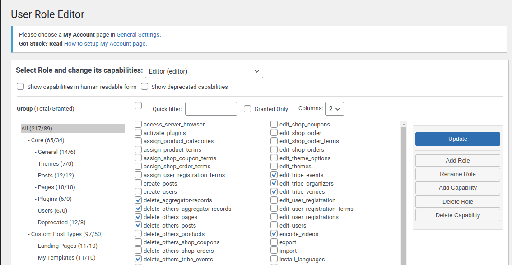
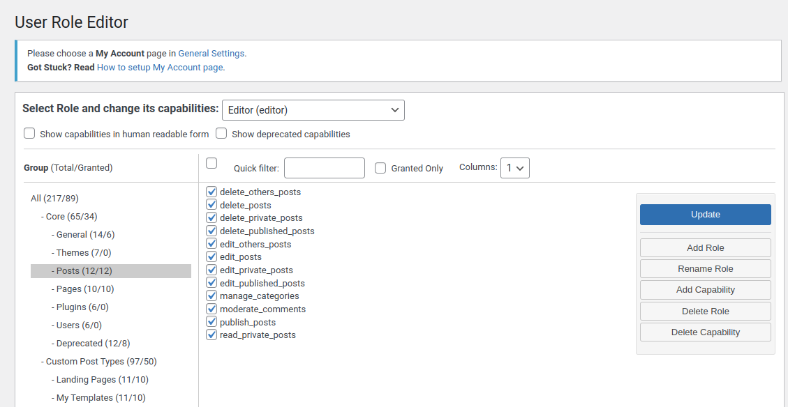

# Users - Roles & Permission

### Collections - users-roles-perm

- categories
- comments
- likes
- permissions
- posts
- roles
- routerpermissions
- userpermissions
- users

### Models/UserPermissionModel.js - This model is used when permission is assign to users

```js
const UserPermissionModel = new Mongoose.Schema({

    user_id:{
        type:mongoose.Schema.Types.ObjectId,
        required: true,
        ref:'User'
    },
    permissions:[{
        permission_name: String,
        permission_value: [number]  // 0-create, 1-read, 2-edit, 3-delete [0,1]
    }]
})

module.exports = mongoose.model('UserPermission', UserPermissionModel);

sample:
{
    "_id": "60d21b4667d0d8992e610c85", // ObjectId generated by MongoDB
    "user_id": "60d21b2067d0d8992e610c84", // ObjectId referencing a User document
    "permissions": [
        {
            "permission_name": "post",
            "permission_value": [0, 1, 2] // create, read, edit permissions
        },
        {
            "permission_name": "comment",
            "permission_value": [1, 3] // read, delete permissions
        }
    ]
}

``` 
### Models/PermissionModel.js - This model is for Admin to   Permission.

```js
const PermissionModel = new Mongoose.Schema({

    permission_name:{
        type:String,
        required: true,        
    },
    is_Default:{
        type:Number,
        default:0  // 0-> Not-Default[False], 1-> Default [True]
    }
});

module.exports = mongoose.model('Permission', UserPermissionModel);
```
### What `is_Default` Means

`is_Default` is a flag used to specify whether a particular permission is automatically included for a role when it is created or initialized.

It uses a numeric value to represent a boolean state:

- `0` → **Not Default**: This permission is optional and not automatically assigned to the role.
- `1` → **Default**: This permission is mandatory or pre-assigned to the role by default.

---

### Role of `is_Default` in Permission Management

#### 1. **Predefined Role Setup**
When creating or initializing roles, you can use `is_Default` to auto-assign certain permissions to a role without manual configuration.

**Example:**
- For a `user` role, permissions like `viewProfile` might be set as default (`is_Default: 1`).
- Permissions like `deleteUser` might be non-default (`is_Default: 0`).

#### 2. **Customizable Roles**
By marking some permissions as **non-default**, administrators or developers can customize roles by adding or removing specific permissions based on requirements.

**For example:**
- An `admin` role might include both default and non-default permissions.
- A `user` role might only include default permissions.

#### 3. **Efficiency in Role Initialization**
During role creation, you can filter for permissions with `is_Default: 1` to auto-assign them without needing to specify them explicitly.

sample:
```json
[
    {
        "_id": "60d21b4667d0d8992e610c86",
        "permission_name": "read",
        "is_Default": 1
    },
    {
        "_id": "60d21b4667d0d8992e610c87",
        "permission_name": "write",
        "is_Default": 0
    },
    {
        "_id": "60d21b4667d0d8992e610c88",
        "permission_name": "execute",
        "is_Default": 0
    },
    {
        "_id": "60d21b4667d0d8992e610c78",
        "permission_name": "comment",
        "is_Default": 1
    }
]
```

### Routes/adminRoutes.js
```js
const { permissionAddValidator } = require('../helper/adminValidator');

// path: http://localhost:3000/api/admin/add-permission
routes.post('add-permission', permissionAddValidator, )
```

### Contoller/admin/adminController.js
```js
const addPermission = async(req, res) => {
    
    try{
            //1. do validation
            //2. recv req
            const { permission_name } = req.body;

            //3. find in database, if same permission is not exists.
            //4. create obj 
            let obj = {
                permission_name
            }
            //5.if want to set default value
            if(req.body.default){
                obj.is_default= parseInt(req.body.default)
            }

            //6.save to db
            const permission = new Permission(obj);
            const newPermission = await permission.save();
        
        return res.status(201).json({
            success:true,
            message:'Permission added Successfully',
            data: newPermission
        })

    }catch(){

    }    
}
```
### Postman

```js
POST | http://localhost:3000/api/admin/add-permission
Body(raw): {
    permission_name:'Comment'
    default:1
}
```

### Controller/admin/PermissionController.js - Create Read, Delete, Update Permission for admin
```js

//Create
const addPermission = () => {}

//Read
const getPermissons = () => {}

//Delete
const deletePermission = () => {}

//Update
const updatePermission = (req, res) => {
    
    // 1. validateRequest - do validation express-validator or JOI (optinal) {_id - requied, permission_name - required }
    // if empty return error

    // 2. isExists - is Id(Permission) exist
    const isExists = await Permission.findOne({
        _id:{
            $ne: _id
        },
        permission_name:{
            $regex: permisson_name,
            $options: i
        }
    });

    // 3. isNameAssigned
    const isNameAssigned = await Permission.findOne({
        _id:{
            $ne: id
        },
        permission_name:{
            $regex: permisson_name,
            $options: 'i'
        }
    });

    // 4. update Permission - findByIdAndUpdate    
}

POSTMAN
POST | http://............./admin/update-permission
Body(raw):{
    'id':'67333a82dbeec2eefa34d2eb',
    'permission_name':'Comment'
}
```

### Only admin can access Admin-Permission
#### Route/adminRoute.js

```js
route.post('/add-permission', auth, onlyAdminAccess, permissionValidator, permissonController.addPermission);

route.get('/get-permission', auth, onlyAdminAccess, permissionValidator, permissonController.getPermission);

route.post('/update-permission', auth, onlyAdminAccess, permissionValidator, permissonController.updatePermission);

route.post('/delete-permission', auth, onlyAdminAccess, permissionValidator, permissonController.deletePermission);
```
#### Add Middleware - Middleware/adminMiddleware.js
```js
const onlyAdminAccess = async(req, res, next) => {
    try{
        //check roles - Not equal to admin ie 1
        if(req.user.role != 1){
            return res.send(400).json({
                success:false,
                message:'You have not permission to access this route!'
            })
        }

    }catch(){

    }
}
```
### Add Role in Admin Panel
```js
Model/roleModel.js

rolesSchema = new mongoose.Schema({
	role_name : { type: String, required:true },
    Value: { type:Number, required:true }
});

Controller/RoleController.js

Const storeRole = () => {}
Const getRole = () => {}

Routes/AdminRoutes.js
route.post('/store-role, auth, onlyAdminAccess, permissionValidator, roleController.storeRole);

route.get('/get-role', auth, onlyAdminAccess, permissionValidator, roleController.getRoles);
```
17. When a user is registered then a default permission is set to that user. So users can only access to write comments on posts and only Do likes. But When user is create By admin
Then the admin can set permission to that user.


18.Create Query to get Permission in Login API.
```js
In $project: {
_id:0
name:0 // only _id can be zero other than that it gives an ERROR.
}
```

19. Add Permissions in Get and Create User API
 So we need to add Permission in user document(in database) 
First open user controller and getUsers()  

```js
GET | http://localhost:3000/api/

Const getUser = () => {
	Const user = await User.aggregate([
{	
$match:{
	_id:{
	$ne: new mongoose.type.ObjectId(req.user._id)
}	
 	},
},{
$lookup:{
	from:”userpermission”,
	localField:”_id”,
    foreignField:”user_id”,
    as:”permissions”
}
},
{
	$project:{
		_id:0
}
}
])}
```

### Add Permissions in GET & CREATE USER api.

#### Controllers/UserController.js

```js
    const createUser = async(req, res) => {
        const {name, email} = req.body;

        const isExist = await User.findOne({email});

        if(isExist){
            return res.status(400).json({
                success:false,
                message:'Email already exist'
            })
        }

        const password = randomstring.generate(6);
        const hashPassword = await bcrypt.hash(password, 10);
        
        let obj = {
            name,
            email,
            password: hashpassword
        }
        
        if(req.body.role && req.body.role == 1){
            return res.status(401).json({
                success:false,
                message:'You can`t create ADMIN'
            })
        }else if(req.body.role){
            obj.role = req.body.role;  // assign role to new user
        }
    
        const user = new User(obj);

        const userData = await user.save();

        //add permission to user if comming in request
        if(req.body.permission != undefined && req.body.permissions.length > 0){
            
            const addPermission = req.body.permissions;

            const permissionArray = [];
        
            await Permission.all(addPermission.map(async (permission)=>{
            
                const permissionData = await Permission.findOne({ _id:permission.id});
                
                permissionArray.push({
                    permission_name:permissionData.permission_name,
                    permission_value:permission.value
                    })
                })
            );
        }

        //if admin is created User - send Mail to User with there user name and password 
        const userEmailTemplate = `<h3>Hi,${userData.name} your password:${userData.password}</h3>`;
        
        const userPermission = new UserPermission({
            user._id = userData._id,
            permission: permissionArray
        });

        await userPermission.save();
    }
```
## User Model will look like this - create user
```js
// create user
// Senario-1: User is create By admin
// Senario-2: User is create By Registration/SignUp (self)

POST | http://..................../api/create-user
Body : {
    name:"new editor",
    email:"newEditor@gmail.com",
    role: 3,
    permission: [
        {
            "id":"65123.............fnb", // Only permission-id is added from permission-Collection This user able to Comment Only
            "value": [0,1,3]  // 0-Create 1-Read 3-Delete ie. This user can create-comment, Read-Comments and delete-comment(his/her comment only) [selected By Checkbox - clientSide]
            
        }   
    ]
}

How `permission` is added in above document
// access by only admin.
GET | POST | http://..................../api/get-permission 
Body: {
    "sucess":true,
    "message":"Fetch Successfully",
    "data":[
        {
            "_id":"65123.............fn4",
            "permission_name":"user",
            "is_default": 0
        },
        {
            "_id":"65123.............fnd",
            "permission_name":"post",
            "is_default": 0
        },
        {
            "_id":"65123.............fnb",
            "permission_name":"comment",
            "is_default": 1
        },
        {
            "_id":"65123.............fna",
            "permission_name":"like",
            "is_default": 1
        },
    ]
}
```
## Similer to below Screensort




### Create Router Permission Model

#### Model/routerPermissionModel.js
```js
const routePermissionSchema = new Mongoose.Schema({

    router_endpoint:{        
        type:String, 
        required: true,        
    },
    roles:{ // clientSide dropdown - with roleId
      //type:mongoose.Schema.Types.ObjectId, - (optinal)
        type:Number, // 0-admin, 1-subadmin, 2-editor, 3-User
        required:true
    },
    permission:{
        type:Number, //0-read 1-write, 2-update, 3-delete
        required:true
    }
})

module.exports = mongoose.model('RoutePermission', routePermissionSchema);
```
POSTMAN
```js
GET_ROUTES_BY_ADMIN

GET | http://.........../api/admin/all-routes
```

```js
Routes/AdminRoute.js

const express = require('express');
const router = express.Router(); //must added if we want all routes of that module, we have to do same for commonRoute.

index.js
app.get('/api/admin/all-routes', auth, onlyAdminAccess, routeController.getAllRoutes);
```
```js
Controller/RouteController.js

const getAllRoutes = async() => {
    
    try{
        const routes = [];
        const stack = req.app._router.stack;

        stack.forEach((data)=>{
            if(data.name === 'router' && data.handle.stack){
                data.handle.stack.forEach((handler)=>{
                    routes.push({
                        path: handler.route.path,
                        methods: handler.route.methods
                    });
                })
            }            
        })
    }catch(){

    }
    
}

Response:
{
    success: true,
    message:'All Routes',
    data: [
        {
            'path':'/add-permission',
            'methods':{
                'post':true
            }
        },
        {
            'path':'/get-permissions',
            'methods':{
                'get':true
            }
        }
    ]
}
```


```js
helper/helper.js

const getRouterPermissions = async() => {

    try{
        const routerPermission =  await RoutePermission.findOne({
            router_endpoint:router,  // /add-category
            role                     //  2-editor
        }).populate('permission_id');

        return routerPermission;
    }catch(error){
        console.log(error);
    }   
}

Middleware/CheckPermission.js


// only admin can access all routes, apart from admin, other users can't access    
const CheckPermission = (req, res, next) => {

    try{
        //check roles - Not equal to admin ie 1
        if(req.user.role != 1){

            const routerPermission = await helper.getRouterPermissions(req.path, req.user.role);
            const userpermissions = await helper.getUserPermission(req.user._id);    // parmissions:{} or {parmissions:[1,2,3]}

            if(!userpermissions.parmissions.parmissions == undefined || !routerPermission){
                return res.send(400).json({
                    success:false,
                    message:'You have not permission to access this route!'
                })
            }

        const permission_name = routerPermission.permission_id.permission_name;
        const permission_value = routerPermission.parmissions; // [1]
       
        let hasPermission = userpermissions.permissions.permissions.some((permission)=>{

                permission.parmission_name == permission_name && 
                permission.parmission_value.some((value)=> permission_value.includes(value))
        });

        if(!hasPermission){
            return res.send(400).json({
                success:false,
                message:'You have not permission to access this route!' 
            });
        }
       
        return next(); // only for admin 
        }
    }catch(error){
        console.log(error);
    }
}

```


Referance:
[User-Roles & Permission](https://www.youtube.com/playlist?list=PLQDioScEMUhl3n7ibx-sl-Y_d__dFrTSr)