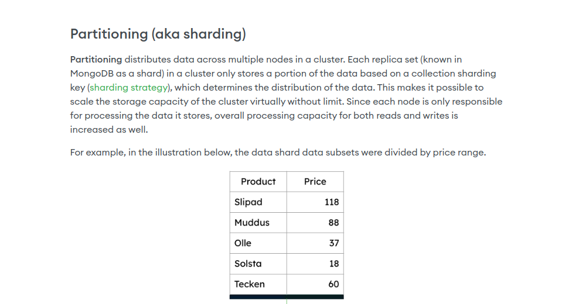
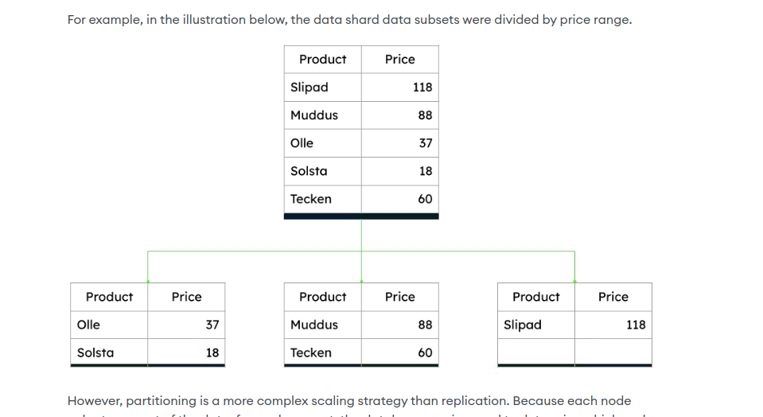
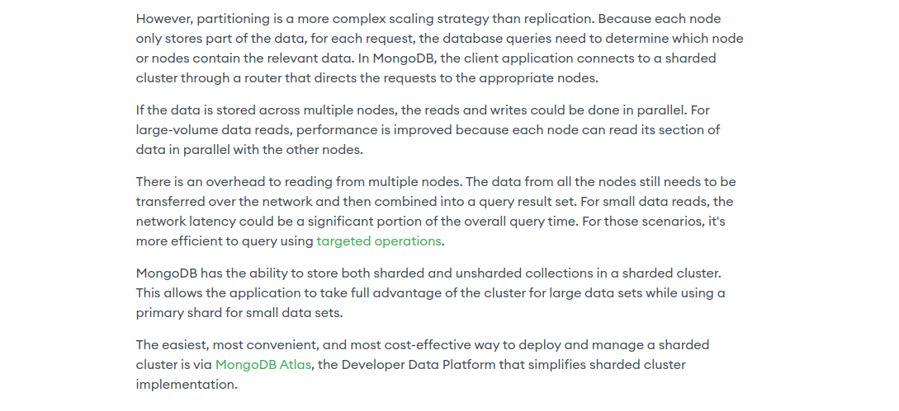

## Table of Contents

- [1. What is MongoDB?](#1-what-is-mongodb)
  - [Scaling](#scaling)
    - [Horizontal Scaling](#horizontal-scaling)
      - [Sharding](#sharding)
      - [Replication](#replication)

- [2. Why we choose MongoDB?](#2-why-do-we-choose-mongodb)
 

## 1. What is MongoDB?

MongoDB is a document database built on a horizontal scale-out architecture that uses a flexible schema for storing data.

Instead of storing data in tables of rows or columns like SQL databases, each record in a MongoDB database is a document described in BSON, a binary representation of the data. Applications can then retrieve this information in a JSON format.

- What is Document database.
- A document database (also known as a document-oriented database or a document store) is a database that stores information in documents.

[Ref : What is Document database](https://www.mongodb.com/resources/basics/databases/document-databases)

- What is a Horizontal scale-out architecture.
- The horizontal scaling approach, sometimes referred to as "scaling out," entails adding more machines to further distribute the load of the database and increase overall storage and/or processing power. There are two common ways to perform horizontal scaling — they include `sharding`, which increases the overall capacity of the system, and `replication`, which increases the availability and reliability of the system.

### MongoDB Official Documentation - Sharding

## Explain Sharding in detail.
**Sharding** in MongoDB is a method for distributing data across multiple servers or nodes, enabling the database to handle large datasets and high-traffic loads efficiently. It is an essential feature for scaling horizontally and ensuring that performance remains high as the amount of data grows. Here's a detailed explanation:

### 1. **What is Sharding?**
   - **Sharding** is a database architecture pattern that divides a large dataset into smaller, more manageable pieces called **shards**. Each shard holds a subset of the overall data.
   - The process helps distribute data storage and query load across multiple servers, known as a **shard cluster**.
   - Sharding enables a MongoDB deployment to scale horizontally by adding more servers to the cluster.

### 2. **Why Use Sharding?**
   - **Handling Large Data Volumes**: When a single server cannot store and process large amounts of data efficiently, sharding splits the data across multiple servers.
   - **Improved Performance**: By spreading the data and query load across multiple servers, sharding can improve query performance and throughput.
   - **Scalability**: Sharding allows for linear scalability; adding more servers (shards) can increase the capacity and processing power of the database.

### 3. **Sharding Architecture Components**:
   - **Shards**: The individual servers or nodes that store a subset of the database. Each shard acts as an independent database with a complete copy of its portion of data.
   - **Shard Key**: A field or set of fields chosen to partition the data across shards. It determines how the data is distributed. Choosing an optimal shard key is crucial for even data distribution and balanced query loads.
   - **Mongos (Query Router)**: A routing service that acts as an interface between client applications and the sharded cluster. It routes queries to the appropriate shard(s) based on the shard key.
   - **Config Servers**: Special servers that store metadata about the cluster's structure, such as the mapping of data ranges to shards. This ensures that `mongos` can route queries efficiently.

### 4. **How Sharding Works**:
   - **Partitioning Data**: The shard key is used to split the data into **chunks**, which are distributed across the shards. Each chunk is a contiguous range of data based on the shard key.
   - **Data Distribution**: The `mongos` uses the shard key to determine which shard a document belongs to. For example, if the shard key is a field called `userId`, documents are distributed across shards based on the value of `userId`.
   - **Query Routing**: When a query is received, `mongos` routes the query to the relevant shard(s) using metadata from the config servers. This ensures that only the necessary shards are queried, reducing the load on the cluster.

### 5. **Shard Key Selection**:
   - **Balanced Distribution**: A good shard key ensures that data is distributed evenly across all shards to avoid hotspots (where one shard holds most of the data or receives the majority of queries).
   - **Query Efficiency**: The shard key should support queries commonly used by the application to allow `mongos` to direct them to a single shard whenever possible.
   - **Avoid Monotonous Growth**: Choosing a shard key that grows monotonically (e.g., timestamps) can lead to unbalanced shards, where one shard receives all new data. This should be avoided by selecting a more distributed key.

### 6. **Types of Sharding**:
   - **Range-Based Sharding**: Data is distributed based on a range of values from the shard key. This is suitable for scenarios where data can be divided into continuous ranges (e.g., numerical IDs or dates).
   - **Hash-Based Sharding**: The shard key is hashed to distribute data evenly across shards. This method helps prevent hotspots but may make range queries less efficient.
   - **Zone Sharding**: Data is distributed based on specified zones, which define data ranges that map to specific shards. This is useful for cases where data locality is important (e.g., data centers in different geographic regions).

### 7. **Shard Balancing and Rebalancing**:
   - **Automatic Balancing**: MongoDB continuously monitors the data distribution across shards. If chunks become unbalanced (e.g., one shard has more chunks than others), the **balancer process** migrates chunks between shards to maintain balance.
   - **Chunk Migration**: The balancer can move chunks between shards to ensure even distribution. This process happens in the background and is designed to minimize the impact on cluster performance.

### 8. **High Availability and Fault Tolerance**:
   - Each shard in a sharded cluster is typically deployed as a **replica set** to provide redundancy and fault tolerance. This ensures that if a shard server fails, the data is still available from a secondary member of the replica set.

### 9. **Advantages of Sharding**:
   - **Scalability**: Easily scale out by adding more shards to distribute data and workload.
   - **High Throughput**: Multiple shards handle queries and operations in parallel, increasing overall throughput.
   - **High Availability**: When combined with replica sets, sharding enhances data availability and fault tolerance.

### 10. **Challenges and Considerations**:
   - **Shard Key Selection**: Choosing the wrong shard key can lead to imbalanced data distribution, poor performance, and hotspots.
   - **Complex Query Routing**: Queries spanning multiple shards may require more complex routing and can result in higher latency.
   - **Maintenance Overhead**: Managing a sharded cluster can be more complex than managing a single-node database due to the need for config servers, `mongos` instances, and monitoring data distribution.

### **Example Scenario**:
Suppose you have a growing e-commerce platform that stores product and order data. Initially, a single MongoDB server might handle the load, but as your user base grows, performance could suffer. By implementing **sharding**:
- You can partition the data using a field like `userId` or `orderId`.
- The load of read and write operations can be spread across multiple shards.
- The system can continue scaling horizontally by adding more shards as the data volume and traffic increase.

In conclusion, **sharding in MongoDB** provides a way to scale out the database horizontally, distributing both data and query load across multiple servers. This approach ensures that MongoDB can handle large datasets and high traffic, maintaining performance and availability as the system grows.

## Explain Replication in detail
**Replication** in MongoDB is a key feature that ensures high availability, data redundancy, and fault tolerance. It allows data to be replicated across multiple servers, providing a safety net in case of server failure and enabling seamless recovery. Here’s a detailed look at how replication works in MongoDB:

### 1. **What is Replication?**
   - **Replication** is the process of synchronizing data across multiple servers. In MongoDB, this is achieved through **replica sets**, which are groups of MongoDB servers that maintain the same dataset.
   - The main goal of replication is to provide **redundancy** and **increase data availability** in distributed systems.

### 2. **Replica Set Architecture**:
   - A **replica set** consists of:
     - **Primary Node**: The main server that receives all write operations. It processes client requests and replicates the data to secondary nodes.
     - **Secondary Nodes**: Servers that replicate data from the primary node. These nodes can be used for read operations (depending on the read preference) and will step up as the new primary if the current primary fails.
     - **Arbiter (optional)**: A member of the replica set that participates in elections but does not hold data. Its main purpose is to break ties during elections to ensure that a majority is reached when electing a new primary.

### 3. **How Replication Works**:
   - **Initial Synchronization**: When a new secondary node is added to the replica set, it performs an initial sync by copying data from the primary node.
   - **Oplog (Operation Log)**:
     - The primary node records all write operations to a special capped collection called the **oplog** (operation log).
     - Secondary nodes continuously read the oplog and apply these operations to maintain an up-to-date state.
   - **Data Consistency**: Secondary nodes replicate data asynchronously, meaning there might be a slight delay before all nodes are fully synchronized. This is called **replication lag**.

### 4. **Failover and Election Process**:
   - If the **primary node** becomes unavailable due to a network issue or hardware failure, the **replica set** initiates an **election** to choose a new primary.
   - The election process is automatic, and it ensures minimal downtime. A secondary node that meets the required conditions becomes the new primary.
   - The **arbiter** can help resolve tie votes to expedite the election.

### 5. **Read and Write Operations in a Replica Set**:
   - **Write Operations**: By default, only the primary node accepts write operations. This maintains consistency as the single source of truth for writes.
   - **Read Operations**:
     - MongoDB allows read operations to be directed to secondary nodes for load balancing. This can be configured using **read preferences** (e.g., `primary`, `secondary`, `primaryPreferred`, `secondaryPreferred`).
     - Applications can leverage secondary reads to distribute the load, but this can lead to reading slightly stale data due to replication lag.

### 6. **Replica Set Deployment Best Practices**:
   - **Odd Number of Members**: To avoid split-brain scenarios and ensure a majority during elections, it’s recommended to have an odd number of members (e.g., 3 or 5 nodes).
   - **Geographical Distribution**: For better disaster recovery, members of a replica set can be distributed across different data centers or regions.
   - **Avoid Single Points of Failure**: Using an arbiter or ensuring multiple secondary nodes helps avoid situations where a failure prevents the election of a new primary.

### 7. **Advantages of Replication**:
   - **High Availability**: Continuous availability even in case of server failures.
   - **Data Redundancy**: Data is replicated across multiple nodes, reducing the risk of data loss.
   - **Load Distribution**: Secondary nodes can serve read requests, reducing the load on the primary node.
   - **Disaster Recovery**: Geographically distributed replica sets enhance resilience against regional outages.

### 8. **Challenges and Considerations**:
   - **Replication Lag**: Secondary nodes may not be fully in sync with the primary at all times. Applications requiring strong consistency need to account for this.
   - **Network Latency**: For geographically distributed replicas, network latency can affect replication speed and election processes.
   - **Maintenance Overhead**: Managing multiple nodes and ensuring their health can be more complex than a standalone server setup.

### Example Scenario:
Consider a **replica set** with three nodes: `Primary`, `Secondary1`, and `Secondary2`. When the `Primary` goes down unexpectedly:
- **Election**: The remaining secondaries vote, and `Secondary1` is chosen as the new `Primary`.
- **Data Integrity**: Once the failed node recovers, it rejoins the set as a secondary and catches up by syncing from the new primary’s oplog.

In summary, **replication in MongoDB** is crucial for building robust, fault-tolerant applications that can handle failures gracefully and ensure continuous availability of data.

[Ref : Database Scaling](https://www.mongodb.com/resources/basics/scaling)

[Ref : horizontal-vs-vertical-scaling](https://www.mongodb.com/resources/basics/horizontal-vs-vertical-scaling)
